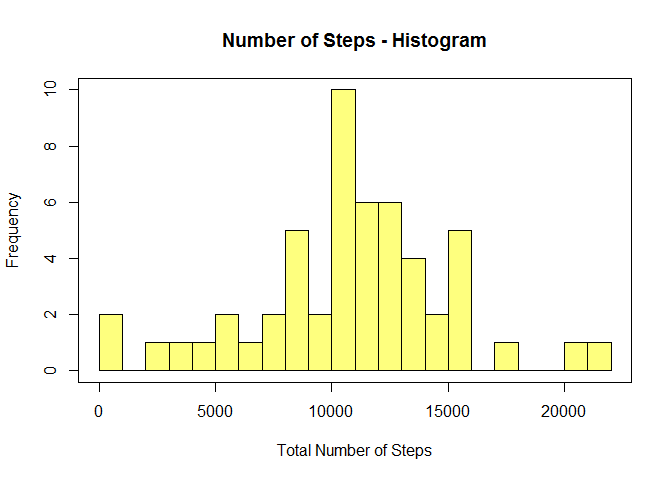
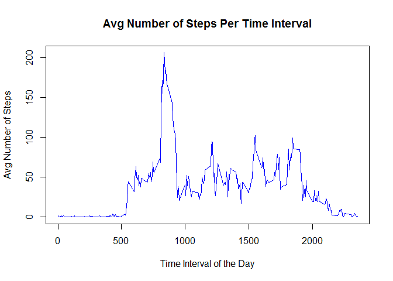
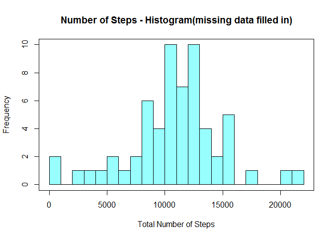
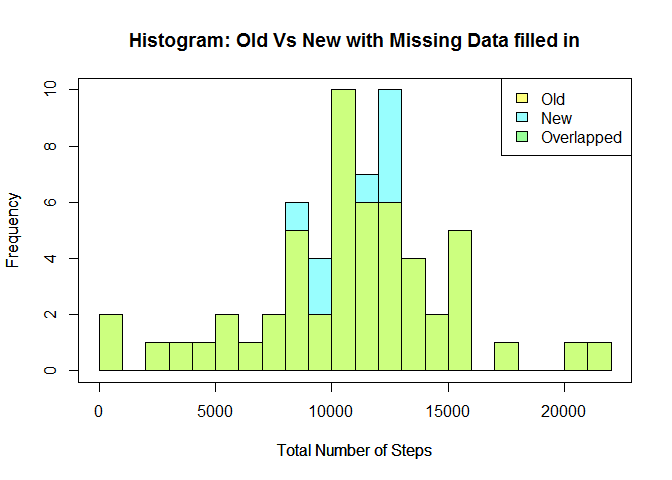
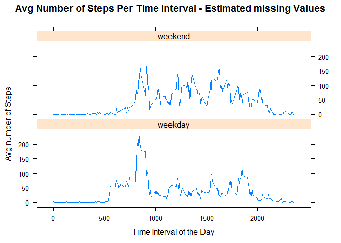

# Reproducible Research: Peer Assessment 1


## Loading and preprocessing the data

#### Load the data

```r
activity <- read.csv("activity.csv")
```
#### Check the structure of the data loaded

```r
str(activity)
```

```
## 'data.frame':	17568 obs. of  3 variables:
##  $ steps   : int  NA NA NA NA NA NA NA NA NA NA ...
##  $ date    : Factor w/ 61 levels "2012-10-01","2012-10-02",..: 1 1 1 1 1 1 1 1 1 1 ...
##  $ interval: int  0 5 10 15 20 25 30 35 40 45 ...
```
#### Extract day of week from date column

```r
activity$date <- as.character(activity$date)            # Convert values from Factor to Character
activity$date <- as.Date(activity$date, "%Y-%m-%d")     # Convert values to date
activity$dayOfWeek <- as.character(activity$date, "%A") # Extract day of Week from date(i.e. Sunday, Monday)
table(activity$dayOfWeek)                               # Verify the data
```

```
## 
##    Friday    Monday  Saturday    Sunday  Thursday   Tuesday Wednesday 
##      2592      2592      2304      2304      2592      2592      2592
```
#### Group the data into parts - Weekday & Weekend

```r
activity$week <- 'weekday'                                                  # Make everything to Weekday
activity$week[activity$dayOfWeek %in% c("Saturday","Sunday")] <- 'weekend'  # Update values to Weekend for Sat & Sun
table(activity$week)                                                        # Verify the data
```

```
## 
## weekday weekend 
##   12960    4608
```
## What is mean total number of steps taken per day?
#### Calculate total number of steps for each day (ignore NA values)

```r
stepsDay <- (with(data=activity, aggregate(steps, by=list(date), FUN=sum )))  # Create new dataset
names(stepsDay) <- c("date","totalSteps")                                                 # Assign Column Names
str(stepsDay)
```

```
## 'data.frame':	61 obs. of  2 variables:
##  $ date      : Date, format: "2012-10-01" "2012-10-02" ...
##  $ totalSteps: int  NA 126 11352 12116 13294 15420 11015 NA 12811 9900 ...
```
#### Histogram of the total number of steps taken each day

```r
hist(stepsDay$totalSteps,breaks=20, xlab="Total Number of Steps", main="Number of Steps - Histogram", col=rgb(1,1,0,0.5))
box()
```

 


#### Mean of total number of steps taken per day

```r
mean(stepsDay$totalSteps, na.rm=TRUE)
```

```
## [1] 10766.19
```
#### Median of total number of steps taken per day

```r
median(stepsDay$totalSteps, na.rm=TRUE)
```

```
## [1] 10765
```
## What is the average daily activity pattern?
#### Calculate Average Number of Steps Taken for each time Interval

```r
stepsInterval <- aggregate(steps ~ interval, data = activity, FUN=mean )  # Create new dataset
stepsInterval$interval <- as.ts(stepsInterval$interval)                   # Convert Interval to Time Series
str(stepsInterval)
```

```
## 'data.frame':	288 obs. of  2 variables:
##  $ interval: Time-Series  from 1 to 288: 0 5 10 15 20 25 30 35 40 45 ...
##  $ steps   : num  1.717 0.3396 0.1321 0.1509 0.0755 ...
```
#### Make a time series plot of the interval (x-axis) and the average number of steps taken, averaged across all days (y-axis)

```r
with(data=stepsInterval,plot(interval, steps,type="l", col="blue", main="Avg Number of Steps Per Time Interval"
     ,xlab="Time Interval of the Day", ylab="Avg Number of Steps"))
```

 

#### The 5-minute interval which contains the maximum number of steps, on average across all the days in the dataset

```r
stepsInterval$interval[which.max(stepsInterval$steps)]
```

```
## [1] 835
```

## Imputing missing values
#### Total number of missing values in the dataset

```r
sum(!complete.cases(activity))    # Number of rows for which at least one NA is present
```

```
## [1] 2304
```
#### Fill in all of the missing values in the dataset
#### Strategy : 
##### 1. Take the subset of data for which Values of Steps is NOT NA
##### 2. Calculate Avg Number of Steps for each Time Interval and Day of Week

```r
avgStepsByWeekDay <- aggregate(steps ~ interval+dayOfWeek, data=activity[!is.na(activity$steps),], FUN=mean) # Create new dataset
names(avgStepsByWeekDay)[3] <- "avgSteps"     # Rename the calculated column
```
##### 3. Create new dataset by Merging Original and new Dataset on basis of Interval and Day of Week

```r
fixedActivities <- merge(activity, avgStepsByWeekDay, by = c("interval","dayOfWeek"))
str(fixedActivities)
```

```
## 'data.frame':	17568 obs. of  6 variables:
##  $ interval : int  0 0 0 0 0 0 0 0 0 0 ...
##  $ dayOfWeek: chr  "Friday" "Friday" "Friday" "Friday" ...
##  $ steps    : int  0 0 NA 0 0 0 0 0 NA NA ...
##  $ date     : Date, format: "2012-10-19" "2012-10-05" ...
##  $ week     : chr  "weekday" "weekday" "weekday" "weekday" ...
##  $ avgSteps : num  0 0 0 0 0 ...
```
##### 4. Update NA steps with the corresponding calcualted mean values from the new dataset

```r
fixedActivities$steps[is.na(fixedActivities$steps)] <- fixedActivities$avgSteps[is.na(fixedActivities$steps)] 
str(fixedActivities)        # New Data Frame with missing data filled in
```

```
## 'data.frame':	17568 obs. of  6 variables:
##  $ interval : int  0 0 0 0 0 0 0 0 0 0 ...
##  $ dayOfWeek: chr  "Friday" "Friday" "Friday" "Friday" ...
##  $ steps    : num  0 0 0 0 0 ...
##  $ date     : Date, format: "2012-10-19" "2012-10-05" ...
##  $ week     : chr  "weekday" "weekday" "weekday" "weekday" ...
##  $ avgSteps : num  0 0 0 0 0 ...
```
#### Calculate total number of steps for each day (missing data filled in)

```r
newStepsDay <- (with(data=fixedActivities, aggregate(steps, by=list(date), FUN=sum , na.rm=TRUE)))  # Create new dataset
names(newStepsDay) <- c("date","totalSteps")                                                 # Assign Column Names
str(newStepsDay)
```

```
## 'data.frame':	61 obs. of  2 variables:
##  $ date      : Date, format: "2012-10-01" "2012-10-02" ...
##  $ totalSteps: num  9975 126 11352 12116 13294 ...
```
#### Histogram of the total number of steps taken each day (missing data filled in)

```r
hist(newStepsDay$totalSteps,breaks=20, xlab="Total Number of Steps", main="Number of Steps - Histogram(missing data filled in)", col=rgb(0,1,1,0.4))
box()
```

 


#### Mean of total number of steps taken per day

```r
mean(newStepsDay$totalSteps, na.rm=TRUE)
```

```
## [1] 10821.21
```
#### Median of total number of steps taken per day

```r
median(newStepsDay$totalSteps, na.rm=TRUE)
```

```
## [1] 11015
```
#### Comparing Old and New Histogram

```r
hist(newStepsDay$totalSteps,breaks=20, xlab="Total Number of Steps",main="Histogram: Old Vs New with Missing Data filled in", col=rgb(0,1,1,0.4))
par(new=TRUE)
hist(stepsDay$totalSteps,breaks=20, xlab="Total Number of Steps",axes=FALSE,main="", col=rgb(1,1,0,0.5))
box()
legend("topright",c("Old","New","Overlapped"), fill=c(rgb(1,1,0,0.5),rgb(0,1,1,0.4), rgb(0,1,0,0.4)))
```

 
#### 

#### Histogram has changed for Mid level Number of steps Steps - where it got increased, but No definite patterns has been observed

#### Comparing Old and New Mean & Median Values

```r
compare <- matrix(c(mean(stepsDay$totalSteps, na.rm=TRUE),mean(newStepsDay$totalSteps, na.rm=TRUE),median(stepsDay$totalSteps, na.rm=TRUE),median(newStepsDay$totalSteps, na.rm=TRUE)), nrow=2, ncol=2)
dimnames(compare) <- list(c("Old", "New"), c("Mean","Median"))
compare
```

```
##         Mean Median
## Old 10766.19  10765
## New 10821.21  11015
```
#### Mean and Median has been increased by a small number

## Are there differences in activity patterns between weekdays and weekends?
#### Dataset  with levels -- "weekday" and "weekend" indicating whether a given date is a weekday or weekend day

```r
str(fixedActivities$week)
```

```
##  chr [1:17568] "weekday" "weekday" "weekday" "weekday" ...
```
#### Average number of steps taken, averaged across all weekday days or weekend days and Interval

```r
stepsInterval <- aggregate(steps ~ interval+week, data = fixedActivities, FUN=mean )
stepsInterval$interval <- as.ts(stepsInterval$interval)
str(stepsInterval$interval)
```

```
##  Time-Series [1:576] from 1 to 576: 0 5 10 15 20 25 30 35 40 45 ...
```
#### Time series plot of the interval (x-axis) and the average number of steps taken for Weekdays & Weekends

```r
library(lattice)
xyplot(steps ~ interval|week, data=stepsInterval, type="l", ylab="Avg number of Steps", xlab="Time Interval of the Day" ,main="Avg Number of Steps Per Time Interval - Estimated missing Values", layout=c(1,2))
```

 
